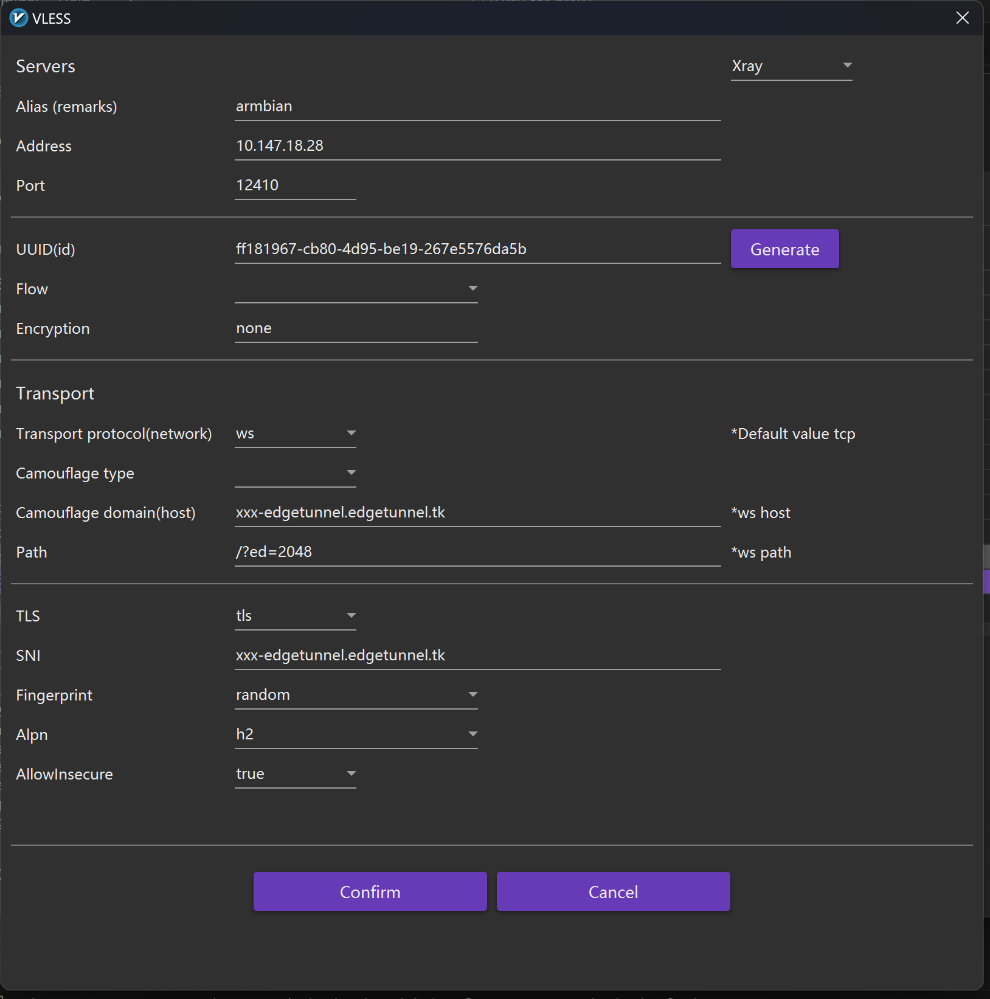

# V2Ray-Tor-Proxy

V2Ray-Tor-Proxy is a simple, easy-to-deploy solution for routing your internet traffic through V2Ray and Tor. It uses Docker Compose to set up and manage the containers.

## Prerequisites

- Docker
- Docker Compose

## Installation

1. Clone the repository:

```bash
git clone https://github.com/3Kmfi6HP/v2ray-tor-proxy
```

2. Change to the cloned directory:

```bash
cd v2ray-tor-proxy
```

3. Start the containers using Docker Compose:

```bash
docker compose up -d
```

The V2Ray and Tor proxy services will now be running in the background.

## Usage

Configure your applications to use the following proxy settings:

- V2Ray proxy (SOCKS5): `localhost:12409`
- Tor proxy (SOCKS5): `localhost:9050`

### Ports

The following ports are exposed by the containers:

- `12345`: V2Ray main port websocket && tcp protocol
- `12410`: V2Ray edgetunnel port reverse proxy cloudflare ip
- `12409`: V2Ray SOCKS5 proxy port
- `9050`: Tor SOCKS5 proxy port (Not exposed to host)

### Tor Configuration

The provided Tor configuration file includes the following settings:

- Hardware acceleration is enabled
- Log level is set to "notice"
- DNS port is set to `8853`
- Multiple SOCKS5 ports are configured from `38801` to `38810`
- `NewCircuitPeriod` is set to 30 seconds
- `CircuitBuildTimeout` is set to 10 seconds
- Strict exit node selection is enabled
- Exit nodes in specific countries are excluded

You can customize these settings by editing the `tor` configuration file in the `/root/v2ray-tor-proxy/tor` directory.

You can now route your traffic through V2Ray or Tor depending on your needs.

### Xray configuration

配置了多个 DNS 服务器，优先使用 `tor-proxy`，然后是 Cloudflare 和 Google 的 DNS。

配置了以下入站协议：

1. `socks`：监听在本地的 12409 端口上，支持用户名和密码验证。
2. `dokodemo-door`：监听在本地的 12410 端口上，转发 sni 代理流量到 cloudflare-dns.com 服务器。
3. `tcp-vless`：VLESS 协议的 TCP 入站，监听在 12345 端口，支持基于 XTLS 的加密传输。
4. `vless`：VLESS 协议的入站，监听在本地的 3001 端口。
5. `ws-vless`：VLESS 协议的 WebSocket 入站，监听在本地的 3002 端口。

配置了以下出站协议：

1. `freedom`：直接连接目标地址。
2. `blackhole`：阻止连接，用于广告拦截。
3. 多个 `socks` 协议的出站，与不同的 Tor 代理服务器连接。

路由

1. 使用负载均衡器实现 Tor 代理的负载均衡。
2. 对于入站协议，使用负载均衡器选择出站代理。
3. 对于广告类域名，使用 `blocked` 出站。

连接节点

监听在本地(vps)的 12410 端口上 cloudflare sni 代理使用方法，需要在 cloudflare worker 上部署 edgetunnel 客户端连接配置参考：

 V2rayNG 设置图

10.147.18.28 是服务器 IP 地址，12410 是 sni 代理端口，xxx-edgetunnel.edgetunnel.tk 是 cloudflare worker 的域名，需要自己部署 worker.

流量流向：`Your device <-> 12410 <-> tor <-> cloudflare worker <-> target`.
你的上网 IP 地址会完全随机，并且每个请求是来自不同国家的 cloudflare cdn 的 IP 地址。理论上，这种方式可以绕过大部分的 IP 封锁。

## Stopping the Services

To stop the containers and clean up the resources, run:

```bash
docker compose down
```

This will stop the V2Ray and Tor proxy services and remove the containers.
